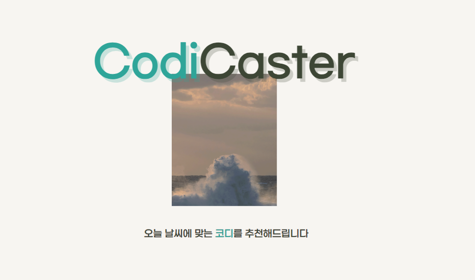

# 🌤 코디캐스터

   
  
   
<h2>오늘 뭐입지? 날씨에 따른 코디 추천 플랫폼 </h2>
가까운 지역순, 비슷한 날씨, 다른 사람들이 입은 코디를 확인하고 스타일을 구성할 수 있어요 
    

<a href="https://codicaster.site/main">지금 확인하기</a>

 

## 팀원 소개
<table>
    <tr>
      <td align="center">박다원</td>
      <td align="center">송호준</td>
      <td align="center">신희수</td>
      <td align="center">조희권</td>
    </tr>
    <tr>
      <td align="center"></td>
      <td align="center"></td>
      <td align="center"><a href="" target="_blank">@Heeesuu</a></td>
      <td align="center"></td>
    </tr>
    <tr>
      <td align="center">Backend Developer</td>
      <td align="center">Backend Developer</td>
      <td align="center">Backend Developer</td>
      <td align="center">Backend Developer</td>
    </tr>
    <tr>
      <td align="center">회원 관리</td>
      <td align="center">날씨 API, 서버 관리</td>
      <td align="center">게시물 관리</td>
      <td align="center">태그, 게시물 추천 관리</td>
    </tr>
  </table>
 

## 프로젝트 소개

   
  
<h4>외출 전, 날씨 때문에 옷차림을 고민해보신적이 있으신가요?</h4> 
이러한 고민은 자신의 주변 사람들의 차림새를 통해 해결되곤 합니다. 
실제로 많은 이들이 주변 사람들의 차림새를 보며 패션에 대한 영감을 얻고, 
그를 바탕으로 자신의 스타일을 구성하는부분에서 도움을 받습니다.
 
 
이러한 일상의 고민과 경험을 바탕으로, 코디캐스터는 사용자들이 날씨에 맞는 코디를 참고하고  
영감을 얻을 수 있는 플랫폼을 제공하는 것을 목표로 합니다.

GIF Images

 

## 기술 스택

 

## 구현 기능

### 기능 1

### 기능 2

### 기능 3

### 기능 4

 

 

## 라이센스

MIT &copy; [NoHack](mailto:lbjp114@gmail.com)

<!-- Stack Icon Refernces -->

[js]: /images/stack/javascript.svg
[ts]: /images/stack/typescript.svg
[react]: /images/stack/react.svg
[node]: /images/stack/node.svg